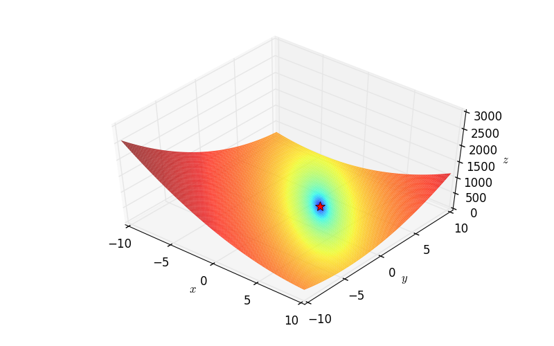
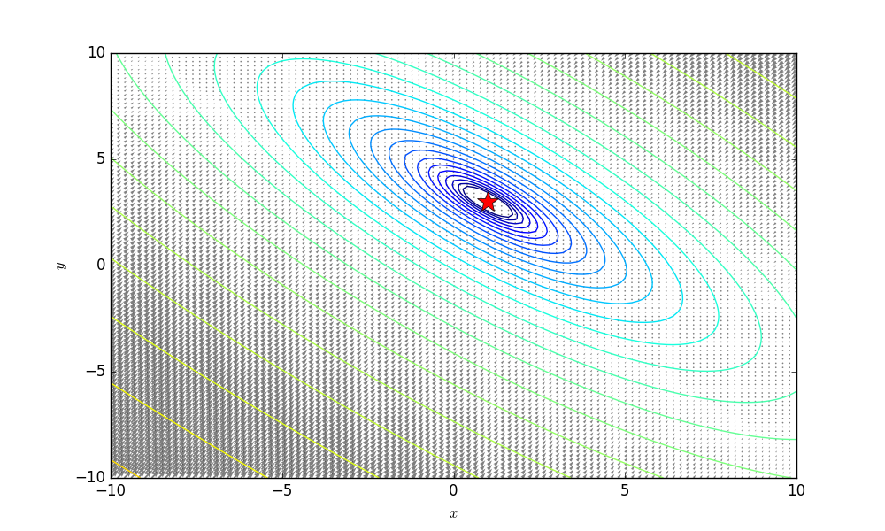
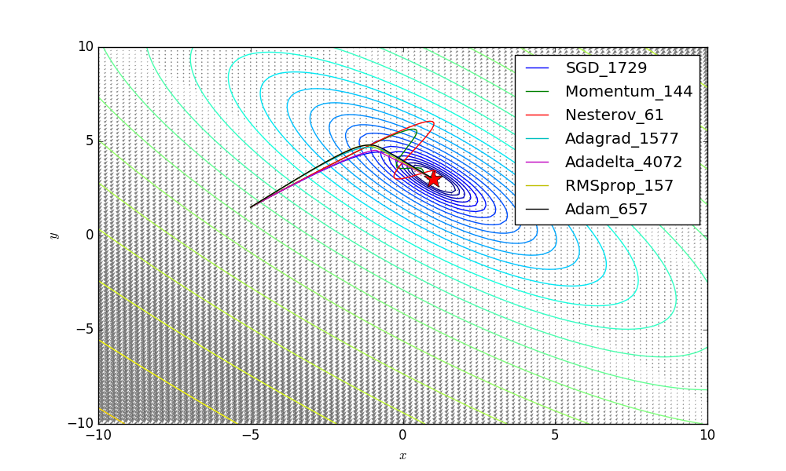
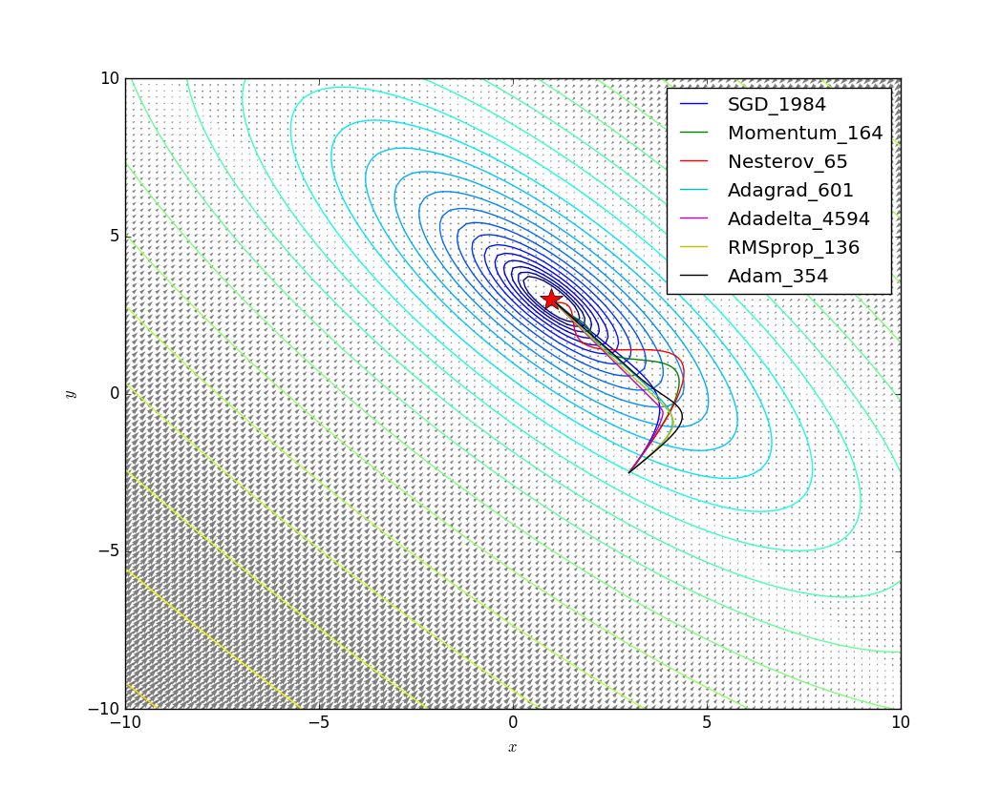

# sgd_gym

Evaluating gradient-based optimization metrics (currently support ["SGD", "Momentum", "Nesterov", "Adagrad", "Adadelta", "RMSprop", "Adam"]) with unit testing functions (currently support ["Beale", "Booth", "Mccormick"]).

For more information, please refer to:

[1] https://en.wikipedia.org/wiki/Test_functions_for_optimization

[2] http://tiao.io/notes/visualizing-and-animating-optimization-algorithms-with-matplotlib/

[3] http://ruder.io/optimizing-gradient-descent/index.html#adagrad

