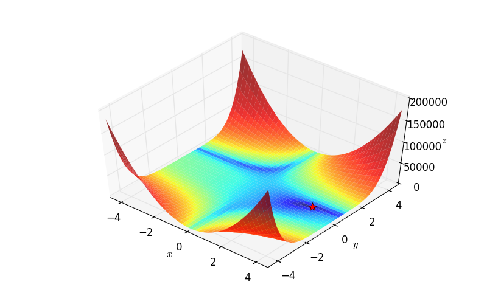
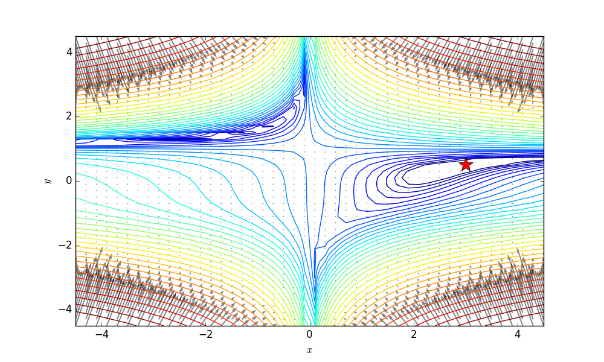
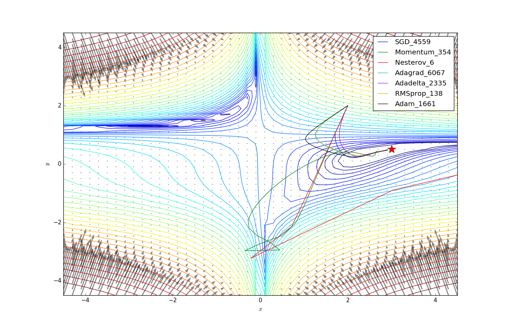
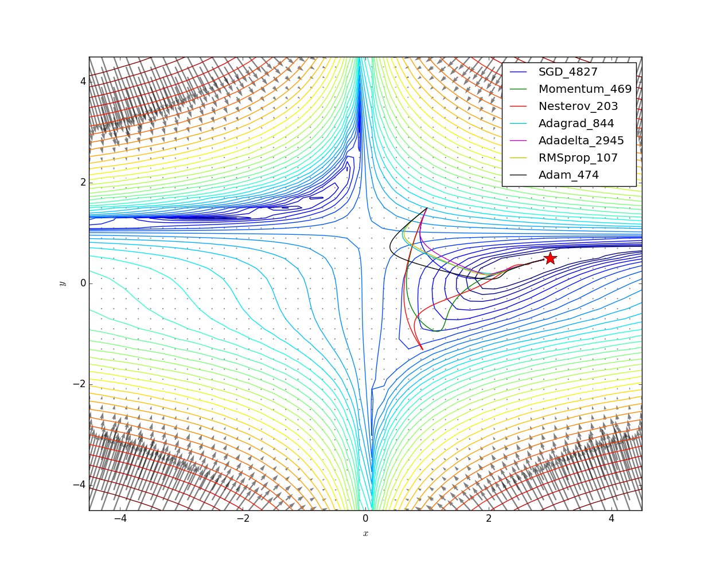

# sgd_gym

Evaluating gradient-based optimization metrics (currently support ["SGD", "Momentum", "Nesterov", "Adagrad", "Adadelta", "RMSprop", "Adam"]) with unit testing functions (currently support ["Beale", "Booth", "Mccormick"]).

